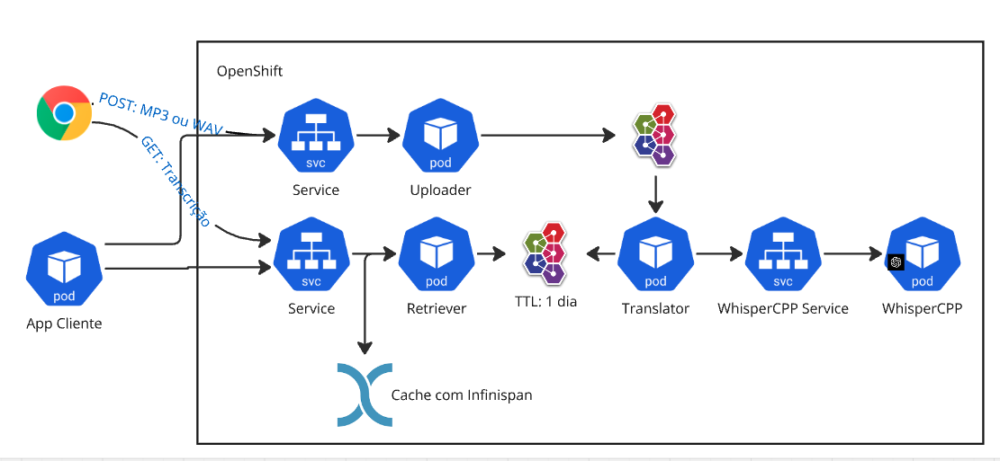

# ead-arq-whisper

# Projetos

## Uploader
Disponibiliza a funcionalidade do upload de arquivos de audio utilizando HTTP/REST, envia esses arquivos via AMQP para o ArtemisMQ.
O retorno do REST são 3 atributos: MessageID, Time (tempo que a transcrição deve demorar) e URLRetrieverID (é um atalho que a aplicação pode fazer o GET)

## Translator
Recupera as mensagens com os arquivos de audio do ActiveMQ, submete para o modelo que faz a transcrição e retorna o texto para o ArtemisMQ

## Retriever
Disponibiliza um modo de acessar as transcrições geradas. Nesse exemplo recuperamos as transcrições diretamente do ArtemisMQ pelo ID.

Pode ser alterado para buscar de um banco (Postgres ou MongoDB) ou cache (Redis ou Infinispan).

## WhisperCPP
Modelo de fato que faz a transcrição.

## Running LOCAL

## Pre requisitos
- Podman
- [Quarkus CLI](https://quarkus.io/guides/cli-tooling)
- Java 17

## Subir ambiente

- `docker compose up` para subir o artemis
- Executar os passos do [WHISPER](whisper/README.md) para build e run do whisper server

- `quarkus dev`, ou `./mvnw quarkus:dev` nos projetos `uploader`, `translator` e `retriever`

- Execute `./upload.sh`. 
- A saída será a identificação da transcrição, ex: `7e36958b-710d-4461-8242-80a85adb42ec`
- Para consultar o resultado da transcrição: `curl localhost:8082/transcriptions/7e36958b-710d-4461-8242-80a85adb42ec`
  - Quando não está pronta, o retorno é vazio cmo http status 404

## Console WEB Artemis
http://localhost:8161/console/

Não funciona ainda corretamente por conta de CORS

## Fontes

https://github.com/ggerganov/whisper.cpp/

https://github.com/containers/ai-lab-recipes/blob/main/models/Containerfile